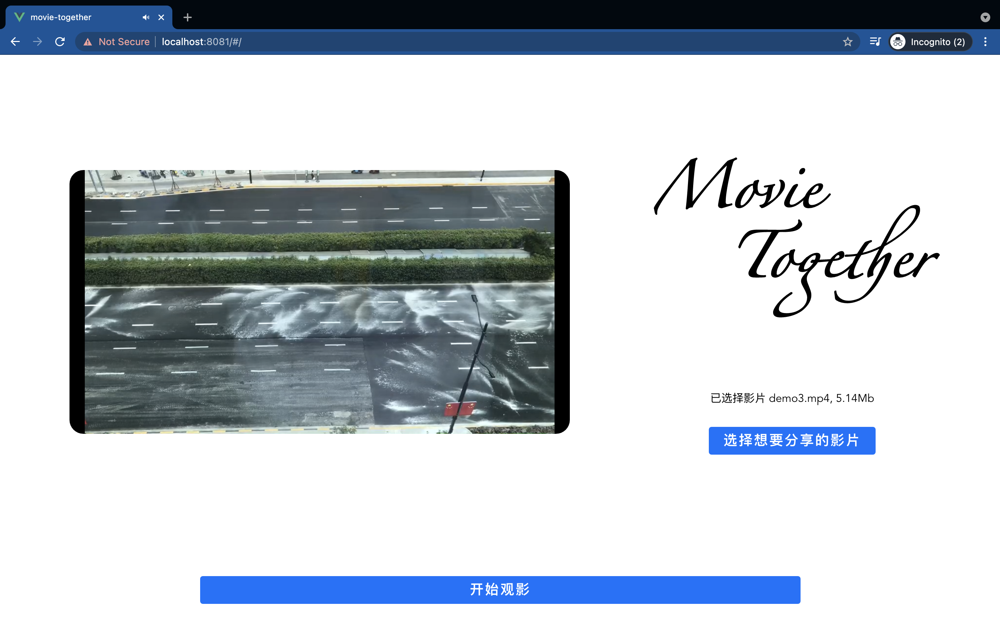
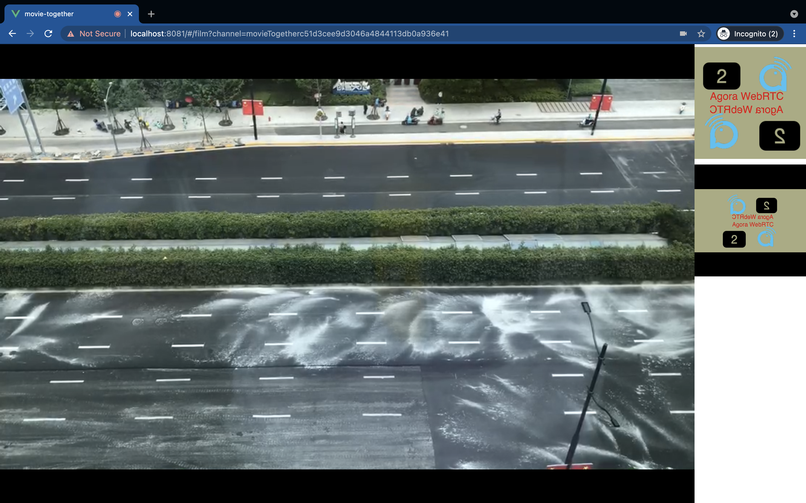

# Movie Together

---

[ENGLISH](./README_EN.md)

## 应用截图

## 介绍

本项目实现了一个可以远端分享音视频流和实时互动的 web DEMO,用户可以使用本应用与好友远程分享影片并同时进行音视频互动。
本项目基于 Agora.io 的 Web SDK `agora-rtc-sdk-ng` 和 Vue 组件库 `agora-rtc-vue` 开发。
本项目的目的在于展示 `agora-rtc-vue` 的 API 和功能。
## 使用

1. 安装依赖
2. 输入你在 Agora.io 官网申请到的 APPID 及对应 TOKEN 到 `src/main.js` 的对应位置
   
   > 参考 [校验用户权限](https://docs.agora.io/cn/Agora%20Platform/token) 了解如何获取 App ID 和 Token。你可以获取一个临时 token，快速运行示例项目。
   >
   > 生成 Token 使用的频道名必须和加入频道时使用的频道名一致。
   > 为提高项目的安全性，Agora 使用 Token（动态密钥）对即将加入频道的用户进行鉴权。
   >
   > 临时 Token 仅作为演示和测试用途。
3. 运行命令`yarn serve`
4. 浏览器打开项目地址
5. 点击 `选择想要分享的影片` 按钮选择影片
6. 点击 `开始观影` 进入观影界面
7. 将观影界面 URL 分享给好友
8. 好友打开链接，即可一起观影并互动

## Q&A

   1. 在Mac下使用Chrome分享影片时, 好友打开URL, 影片界面是绿色的
      Mac 下 Chrome 存在 BUG, 关闭Chrome硬件加速功能，重新分享
   2. 无法打开页面
      在浏览器和系统设置中信任HTTPS证书

## 参考文档

- [Agora.io 官网](https://www.agora.io)
- [Web SDK 文档](https://docs.agora.io/cn/Voice/API%20Reference/web_ng/index.html)
- [agora-rtc-vue 文档](https://webdemo.agora.io/agora_rtc_vue_doc/)

## 反馈

如果你有任何问题或建议，可以通过 issue 的形式反馈。

## 免责声明

本项目代码用于展示 Agora.io 的相关产品的 API 和相关的相关功能，不是完整的本地线上环境运行的完整项目，仅供翻译学习之用，不得用于商业用途，Agora.io 对使用本项目代码任何非学习用途而产生的任何损失和责任不承担任何责任。

您在使用本项目时，请遵守当地的相关法律规定，请确认使用过程中您对使用的音频和视频拥有使用和传播的权利，并确认音频和视频内容符合所属地区法律法规的规定，您需对使用的音频和视频内容的真实性、合法性、无害性、有效性等全权负责，与您使用的视频和音频内容相关的任何法律责任由您自行承担，Agora.io不承担任何责任。

在本项目遵循GPL协议的基础上，Agora.io对本项目代码保留所有权利。

## 相关资源

- 你可以先参阅 [常见问题](https://docs.agora.io/cn/faq)
- 如果你想了解更多官方示例，可以参考 [官方 SDK 示例](https://github.com/AgoraIO)
- 如果你想了解声网 SDK 在复杂场景下的应用，可以参考 [官方场景案例](https://github.com/AgoraIO-usecase)
- 如果你想了解声网的一些社区开发者维护的项目，可以查看 [社区](https://github.com/AgoraIO-Community)
- 若遇到问题需要开发者帮助，你可以到 [开发者社区](https://rtcdeveloper.com/) 提问
- 如果需要售后技术支持, 你可以在 [Agora Dashboard](https://dashboard.agora.io) 提交工单